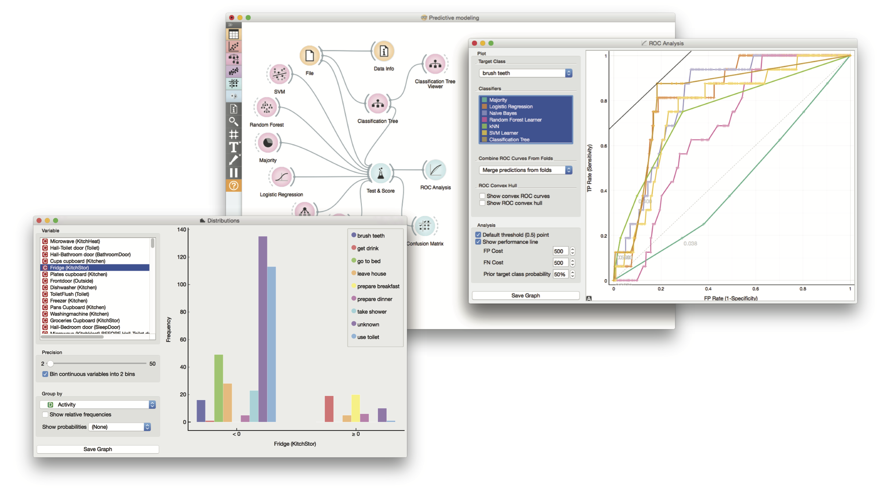

# [According to Sensor 22 Benny is Preparing Dinner](http://dl.acm.org/citation.cfm?id=2872292.2845139&coll=portal&dl=ACM)

<figure><figcaption>Predicting human activities of daily living (ADL) from sensor activations in Orange, http://orange.biolab.si.</figcaption></figure>
